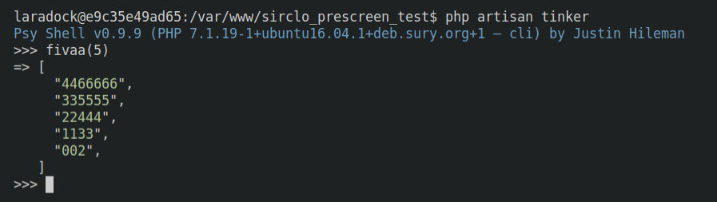
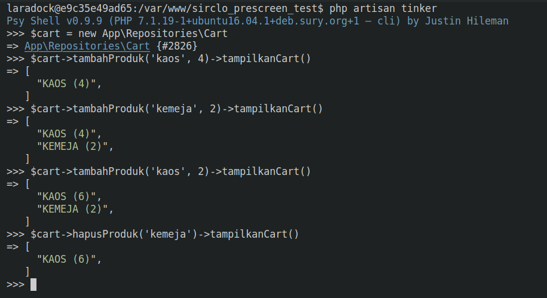
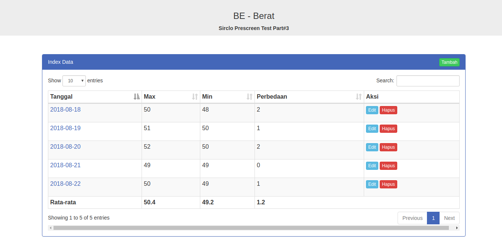
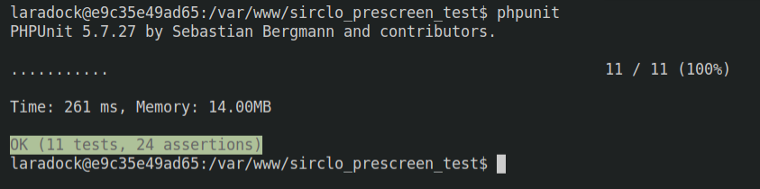

## SIRCLO PRESCREEN TEST
Menggunakan laravel 5.4 dalam menjawab soal teknis yang diberikan

### Persyaratan
- PHP >= 5.6.4
- OpenSSL PHP Extension
- PDO PHP Extension
- Mbstring PHP Extension
- Tokenizer PHP Extension
- XML PHP Extension
- SQLite3 PHP Extension
- PDO SQLite PHP Extension

### Instalasi
- git clone
- cp .env.example .env
- edit .env  , sesuaikan bagian APP_URL
- composer install
- php artisan key:generate
- php artisan migrate --seed

### Soal Pertama

membuat fungsi fivaa, logic file berada di `app\Helpers\GlobalFunc.php`
uji coba menggunakan tinker
- php artisan tinker
- fivaa(5)

### Soal Kedua

membuat library Cart, logic file berada di `app\Repositories\Cart.php`
uji coba menggunakan tinker
- php artisan tinker
- $cart = new App\Repositories\Cart
- $cart->tambahProduk('kaos', 4)->tampilkanCart()
- $cart->tambahProduk('kemeja', 2)->tampilkanCart()
- $cart->tambahProduk('kaos', 2)->tampilkanCart()
- $cart->hapusProduk('kemeja')->tampilkanCart()

### Soal Ketiga

crud data berat
- php artisan serve
- dan tak lupa edit .env  , sesuaikan bagian APP_URL

### tambahan

testing menggunakan phpunit "OK (11 tests, 24 assertions)"
- test fivaa berada di `tests\Feature\FivaaTest.php`
- test cart berada di `tests\Feature\CartTest.php`
- test crud berada di `tests\Feature\BeratTest.php`
- test json data berada di `tests\Feature\SourceDataBeratTest.php`
- test page not found berada di `tests\Feature\PageNotFoundTest.php`